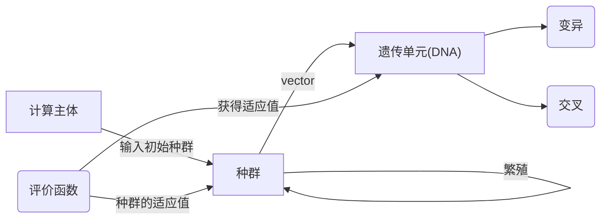
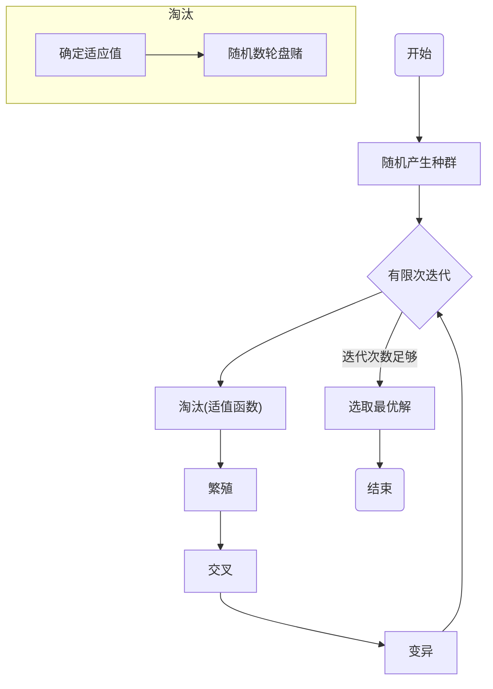

关系

```mermaid
graph LR

main[计算主体]
base["遗传单元(DNA)"]
pingjia(评价函数)
vbase[种群]

vbase --vector--> base
main --输入初始种群--> vbase
pingjia --获得适应值--> base
pingjia --种群的适应值--> vbase
vbase --繁殖--> vbase
base --> by(变异)
base --> jc(交叉)
```

基本流程图

```mermaid
graph TD
start(开始)
init[随机产生种群]
while{有限次迭代}
out["淘汰(适值函数)"]
new[繁殖]
fen[交叉]
by[变异]
best[选取最优解]
ed(结束)

subgraph 淘汰
确定适应值 --> 随机数轮盘赌
end

start --> init
init --> while
while --> out
out --> new 
new --> fen
fen --> by
by -->while
while --迭代次数足够--> best
best --> ed

```

