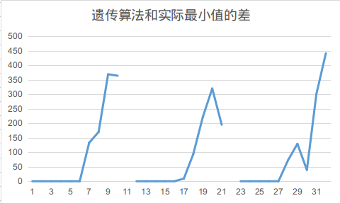
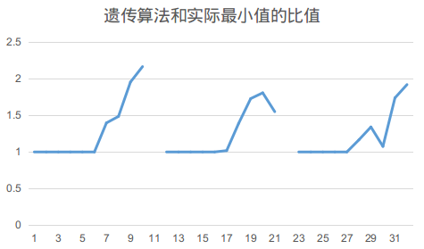
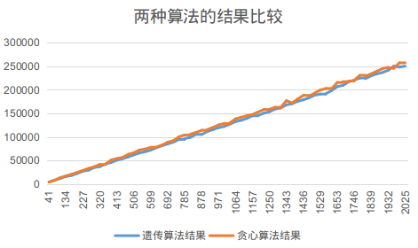
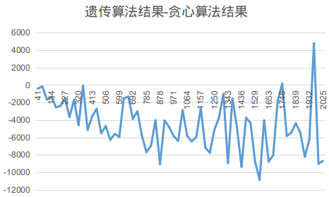
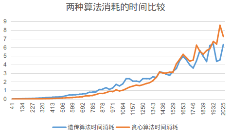
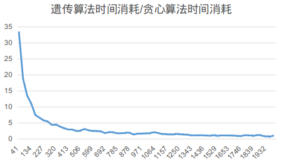

# 实现

通过事先定义的基类实现个体的功能和定义

基类通过实现与另一个个体的交叉和变异方法实现算法

可以通过向群体类中设置修复函数和检查函数启用遗传算法的检查修复功能

# 样例解释

这里以计算tsp问题求解样例为例

文件在`src/tspProblem.cpp`下

```c++
vector<int> test(vector<vector<int>>cost_map) {
    // 随机数种子重置
    srand((unsigned)time(NULL));
    vector<std::shared_ptr<::theNext::unitBase> > firstGroup;
    for(int i = 0; i < 12; ++i) {
        // 生成12个随机初始样本
        firstGroup.push_back(::theNext::DNA::tspDNA::makeRandom(cost_map.size()));
    }
    unitVectorMulti<DNA::tspDNA> init(firstGroup);
    // 编写适应值计算函数
    auto adapt = [&cost_map](const ::theNext::DNA::tspDNA & dna) {
        int sum = 0;
        for(int i = 1; i < cost_map.size(); ++i) {
            sum += cost_map[dna.getDNA()[i - 1]][dna.getDNA()[i]];
        }
        sum += cost_map[dna.getDNA()[cost_map.size() - 1]][0];
        return maxCost * cost_map.size() - sum;
    };
    // 设置适应值计算函数
    init.setAdaptFun(adapt);
    // 进行6轮繁殖和淘汰
    for(int i = 0; i < 6; ++i) {
        init = init.increase();
        init.eliminate();
    }
    // 取出最终的种群
    auto group = init.getGroup();
    double max_adapt = 0.0;
    ::std::shared_ptr<::theNext::unitBase> best = nullptr;
    // 循环查找最优解
    for(int i = 0; i < group.size(); ++i) {
        double ada = adapt(*((::theNext::DNA::tspDNA *)group[i].get()));
        if(ada > max_adapt) {
            max_adapt = ada;
            best = group[i];
        }
    }
    // 返回最优路径
    return ((::theNext::DNA::tspDNA *)best.get())->getDNA();
}
```

同时继承DNA基类实现特殊的`DNA`类型实现tsp问题的描述，交叉和变异

具体`DNA`文件见`include/DNA/DNAtsp.hpp`

```c++
class tspDNA: public unitBase {
public:
    typedef ::std::vector<int> DNA_t;
    typedef tspDNA unit_t;
    tspDNA(int size): path(size) {
        for(int i = 0; i < size; ++i) {
            path[i] = i;
        }
    }
    void variation(rate_t rate) {
        int l = rand() % path.size(),
            r = rand() % path.size();
        while(l == r) {
            r = rand() % path.size();
        }
        auto tmp = path[l];
        path[l] = path[r];
        path[r] = tmp;
    }

    void overlap(const ::std::shared_ptr<unitBase> &base) {
        DNA_t others_dna(((unit_t *)base.get())->getDNA());
        int i = rand() % path.size(), v;
        do {
            v = path[i];
            path[i] = others_dna[i];
            if(findI(path, v) == -1) {
                i = findI(others_dna, v);
            } else {
                break;
            }
        } while(true);
    }
    ::std::shared_ptr<unitBase> copy() {
        ::std::shared_ptr<unitBase> ptr(new tspDNA(this->path.size()));
        return ptr;
    }
    std::vector<int> &getDNA() {
        return this->path;
    }
    const std::vector<int> &getDNA()const {
        return this->path;
    }
    static ::std::shared_ptr<unitBase> makeRandom(int size) {
        auto t = new tspDNA(size);
        for(int i = 2; i < t->path.size(); ++i) {
            // 使i与之前某个量交换
            int k = i - rand() % i;
            std::swap(t->path.at(i), t->path.at(k));
        }
        ::std::shared_ptr<unitBase> ans(t);
        return ans;
    }
protected:
    static int findI(::std::vector<int> &contain, int value) {
        for(int i = 0; i < contain.size(); ++i) {
            if(contain.at(i) == value) {
                return i;
            }
        }
        return -1;
    }
private:
    std::vector<int> path;
};
```

# 正确性分析

下图表现遗传算法和暴力搜索之间数值的差异

使用随机生成的估值地图，计算最小`cost`



这里进行了三次实验，三次实验均使用`2-10`的数据规模进行实验

可以看出随着计算规模的增加，计算误差越来越大

比值上也是越来越大



#效率分析

通过在网上找到的一种贪心算法求解tsp问题的代码比较编写的遗传算法的代码

两者计算结果相差无几



相比而言，遗传算法的答案更小，更精确



但是两者消耗的时间差别较大



如果将两者时间的比值对比，差距会更加明显



可见，随着计算规模的增加，遗传算法在时间复杂度上的优势更佳明显